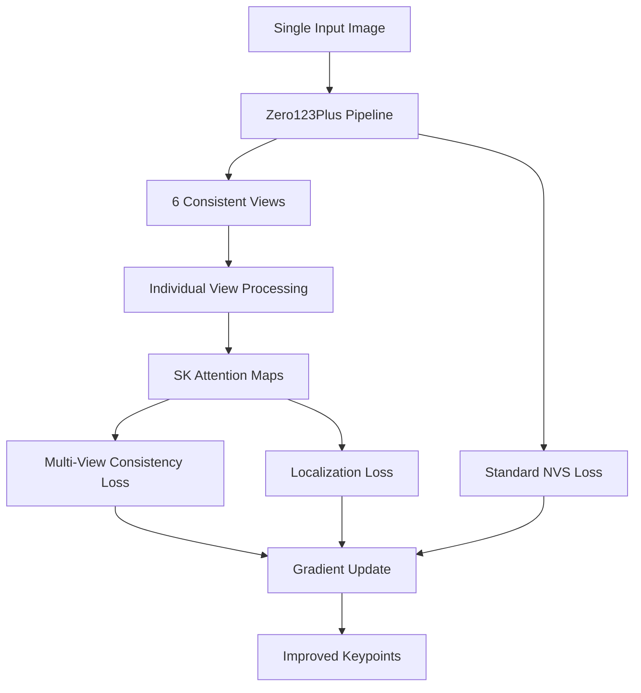

# StableKeypoints + Zero123Plus Integration Plan

## Executive Summary

This document outlines the comprehensive plan for integrating **StableKeypoints (SK) unsupervised keypoint discovery** with **Zero123Plus multi-view synthesis** to create a self-supervised keypoint learning system. The goal is to leverage Zero123Plus's ability to generate consistent multi-view images to provide supervision for keypoint consistency across different viewpoints, enabling the discovery of semantically meaningful 3D-consistent keypoints without manual annotations.

## Current Implementation Status

### ✅ **Completed Components**

#### 1. Basic Architecture Integration
- **Learnable Embeddings**: 16 trainable text embeddings (1024-dim) successfully initialized and integrated
- **Embedding Concatenation**: CLIP embeddings (77 tokens) + learnable embeddings (16 tokens) = 93 total tokens
- **Pipeline Modification**: Zero123Plus pipeline extended with SK parameter management
- **Data Flow**: Multi-view data (1 condition + 6 target views) properly loaded and processed

#### 2. Forward Pass Integration
```python
# Successfully implemented in model.py:
encoder_hidden_states = torch.cat([prompt_embeds, learnable_embeddings], dim=1)
# Shape: [batch, 77+16, 1024] = [batch, 93, 1024]
```

#### 3. Training Infrastructure
- **Loss Weighting**: SK losses (sharpening: 1.0, nvs: 1.0) configurable
- **Optimizer Integration**: Learnable embeddings added to optimizer parameters
- **Multi-GPU Support**: Distributed training on 2x A100 GPUs working
- **Data Loading**: StableKeypointObjaverseData successfully loading multi-view data

### 🔄 **In Progress Components**

#### 1. Attention Map Extraction
- **Current State**: Attention computation visible in logs but maps not being captured
- **Issue**: Attention maps computed but not stored for SK loss computation
- **Next Step**: Implement attention map collection mechanism

#### 2. SK Loss Computation
- **Current State**: Sharpening loss framework implemented but not getting attention data
- **Missing**: Connection between UNet attention computation and SK loss functions
- **Needed**: Proper attention map aggregation across layers and heads

### ❌ **Missing Components**

#### 1. Multi-View Keypoint Consistency
- **Cross-View Loss**: Loss function to ensure keypoints remain consistent across the 6 target views
- **3D Geometric Consistency**: Leveraging camera pose information for geometric constraints
- **Temporal Consistency**: If using video sequences, ensuring keypoint tracking across frames

#### 2. Attention Map Post-Processing
- **Spatial Upsampling**: Current attention maps are low-resolution (need upsampling to 128x128)
- **Multi-Layer Aggregation**: Combining attention from different UNet layers (typically layers 7-10)
- **Multi-Head Fusion**: Aggregating attention across multiple attention heads

## Technical Architecture

### Data Flow Overview



### Core Innovation: Multi-View Self-Supervision

The key insight is that Zero123Plus generates geometrically consistent views of the same object. If keypoints are semantically meaningful, they should:

1. **Spatial Consistency**: Maintain Gaussian-like attention patterns in each view
2. **Cross-View Consistency**: Correspond to the same semantic parts across all 6 views
3. **3D Geometric Consistency**: Respect the known camera transformations between views

### Mathematical Framework

#### 1. Total Loss Function
```python
L_total = λ_nvs * L_nvs + λ_loc * L_localization + λ_cons * L_consistency + λ_geo * L_geometric
```

Where:
- **L_nvs**: Standard Zero123Plus novel view synthesis loss
- **L_localization**: Encourages Gaussian-like attention patterns (per view)
- **L_consistency**: Ensures semantic consistency across views
- **L_geometric**: Enforces 3D geometric constraints

#### 2. Localization Loss (Per View)
```python
L_localization = Σ_view Σ_token ||M_token^view - G_token^view||²
```
- **M_token^view**: Attention map for token in specific view
- **G_token^view**: Target Gaussian centered at max attention location

#### 3. Cross-View Consistency Loss (NEW)
```python
L_consistency = Σ_token Σ_view1,view2 ||project(kp_token^view1, T_view1→view2) - kp_token^view2||²
```
- **kp_token^view**: Keypoint location for token in view
- **T_view1→view2**: Camera transformation between views
- **project()**: 3D→2D projection using known camera parameters

## Implementation Roadmap

### Phase 1: Attention Map Collection (IMMEDIATE)

#### 1.1 Modify SKAttnProc to Store Attention Maps
```python
class SKAttnProc(AttnProcessor2_0):
    def __call__(self, attn, hidden_states, encoder_hidden_states=None, **kwargs):
        # ... existing attention computation ...
        
        # Store attention maps for SK processing
        if hasattr(kwargs, 'cross_attention_kwargs'):
            cross_kwargs = kwargs['cross_attention_kwargs']
            if 'ref_sk_loss' in cross_kwargs:
                # Extract SK-relevant attention (last 16 tokens)
                sk_attention = attention_probs[:, :, -16:]  # [heads*batch, spatial, 16]
                
                # Store in cross_attention_kwargs for loss computation
                if 'attention_maps' not in cross_kwargs['ref_sk_loss']:
                    cross_kwargs['ref_sk_loss']['attention_maps'] = []
                
                cross_kwargs['ref_sk_loss']['attention_maps'].append({
                    'layer_name': self.name,
                    'attention': sk_attention.detach(),
                    'spatial_shape': (height, width)
                })
```

#### 1.2 Aggregate Multi-Layer Attention
```python
def aggregate_attention_maps(stored_maps, target_layers=['mid_block.attentions.0']):
    """Aggregate attention maps from specific UNet layers"""
    aggregated = None
    count = 0
    
    for map_data in stored_maps:
        if any(layer in map_data['layer_name'] for layer in target_layers):
            attn = map_data['attention']  # [heads*batch, spatial, 16]
            h, w = map_data['spatial_shape']
            
            # Reshape and average across heads
            batch_size = attn.shape[0] // attn.shape[1] * attn.shape[1] // (h * w)
            attn_reshaped = attn.view(batch_size, -1, h * w, 16)  # [batch, heads, spatial, tokens]
            attn_avg = torch.mean(attn_reshaped, dim=1)  # [batch, spatial, tokens]
            
            if aggregated is None:
                aggregated = attn_avg
            else:
                aggregated += attn_avg
            count += 1
    
    return aggregated / count if count > 0 else None
```

### Phase 2: Multi-View Processing (WEEK 1)

#### 2.1 Individual View Attention Extraction
```python
def process_individual_views(target_latents, cond_latents, learnable_embeddings, unet):
    """Process each of the 6 target views individually to get per-view attention maps"""
    batch_size, num_views = target_latents.shape[:2]  # [batch, 6, channels, h, w]
    view_attention_maps = []
    
    for view_idx in range(num_views):
        # Extract single view
        single_view = target_latents[:, view_idx]  # [batch, channels, h, w]
        
        # Create cross_attention_kwargs for this view
        view_kwargs = {
            'cond_lat': cond_latents,
            'ref_sk_loss': {'attention_maps': []},
            'learnable_embeddings': learnable_embeddings,
        }
        
        # Forward pass for this view (without noise - just for attention)
        with torch.no_grad():
            _ = unet(
                single_view,
                torch.zeros(batch_size, device=single_view.device),  # t=0 for attention extraction
                encoder_hidden_states=torch.cat([prompt_embeds, learnable_embeddings], dim=1),
                cross_attention_kwargs=view_kwargs,
                return_dict=False,
            )
        
        # Extract and process attention maps for this view
        view_attention = aggregate_attention_maps(view_kwargs['ref_sk_loss']['attention_maps'])
        view_attention_maps.append(view_attention)
    
    return torch.stack(view_attention_maps, dim=1)  # [batch, num_views, spatial, tokens]
```

#### 2.2 Cross-View Consistency Loss
```python
def compute_cross_view_consistency_loss(attention_maps, camera_poses=None):
    """
    Compute consistency loss across the 6 views
    
    Args:
        attention_maps: [batch, 6, spatial, 16] attention for each view
        camera_poses: Camera transformation matrices (if available)
    """
    batch_size, num_views, spatial_dim, num_tokens = attention_maps.shape
    consistency_loss = 0.0
    
    for token_idx in range(num_tokens):
        token_maps = attention_maps[:, :, :, token_idx]  # [batch, 6, spatial]
        
        # Find keypoint locations in each view
        keypoint_locations = []
        for view_idx in range(num_views):
            view_map = token_maps[:, view_idx]  # [batch, spatial]
            # Find max location for each batch element
            max_locs = find_max_pixel_batch(view_map)  # [batch, 2]
            keypoint_locations.append(max_locs)
        
        keypoint_locations = torch.stack(keypoint_locations, dim=1)  # [batch, 6, 2]
        
        # Compute pairwise consistency
        for i in range(num_views):
            for j in range(i + 1, num_views):
                # Simple L2 consistency (can be enhanced with 3D geometry)
                loc_diff = keypoint_locations[:, i] - keypoint_locations[:, j]
                consistency_loss += torch.mean(torch.sum(loc_diff ** 2, dim=-1))
    
    return consistency_loss / (num_tokens * num_views * (num_views - 1) / 2)
```

### Phase 3: 3D Geometric Constraints (WEEK 2)

#### 3.1 Camera Pose Integration
Zero123Plus uses fixed camera poses:
- **Elevation angles**: 30° downward, 20° upward
- **Azimuth angles**: Starting at 30°, incrementing by 60°
- **Layout**: 6 views in 3×2 grid

```python
def get_zero123plus_camera_poses():
    """Get the standardized camera poses used by Zero123Plus"""
    elevations = [30, 30, 30, -20, -20, -20]  # degrees
    azimuths = [30, 90, 150, 210, 270, 330]   # degrees
    
    camera_matrices = []
    for elev, azim in zip(elevations, azimuths):
        # Convert to camera transformation matrix
        R = rotation_matrix_from_angles(np.radians(elev), np.radians(azim))
        t = np.array([0, 0, 2.0])  # Distance from object
        T = np.eye(4)
        T[:3, :3] = R
        T[:3, 3] = t
        camera_matrices.append(T)
    
    return np.stack(camera_matrices)
```

#### 3.2 3D Geometric Consistency Loss
```python
def compute_geometric_consistency_loss(keypoint_locations, camera_poses, intrinsics):
    """
    Enforce 3D geometric consistency using known camera poses
    
    Args:
        keypoint_locations: [batch, 6, num_tokens, 2] 2D keypoint locations per view
        camera_poses: [6, 4, 4] camera transformation matrices
        intrinsics: [3, 3] camera intrinsic matrix
    """
    batch_size, num_views, num_tokens = keypoint_locations.shape[:3]
    geometric_loss = 0.0
    
    for token_idx in range(num_tokens):
        token_locations = keypoint_locations[:, :, token_idx, :]  # [batch, 6, 2]
        
        # Triangulate 3D point from multiple views
        points_3d = triangulate_from_multiple_views(
            token_locations, camera_poses, intrinsics
        )  # [batch, 3]
        
        # Reproject 3D points to all views and compute reprojection error
        reprojection_loss = 0.0
        for view_idx in range(num_views):
            projected_2d = project_3d_to_2d(
                points_3d, camera_poses[view_idx], intrinsics
            )  # [batch, 2]
            
            observed_2d = token_locations[:, view_idx, :]  # [batch, 2]
            reprojection_error = torch.sum((projected_2d - observed_2d) ** 2, dim=-1)
            reprojection_loss += torch.mean(reprojection_error)
        
        geometric_loss += reprojection_loss / num_views
    
    return geometric_loss / num_tokens
```

### Phase 4: Training Loop Integration (WEEK 3)

#### 4.1 Complete Forward Pass
```python
def forward_unet_with_sk_multiview(self, latents_noisy, target_latents, t, prompt_embeds, cond_latents):
    """
    Enhanced forward pass with complete SK multi-view integration
    """
    # Standard UNet forward for NVS loss
    pred_noise, _ = self.forward_unet_with_sk(latents_noisy, target_latents, t, prompt_embeds, cond_latents)
    
    # Extract attention maps from individual views (separate forward passes)
    view_attention_maps = self.process_individual_views(
        target_latents, cond_latents, self.pipeline.get_learnable_embeddings(), prompt_embeds
    )
    
    # Compute SK losses
    sk_losses = {}
    
    # 1. Localization loss (per view)
    localization_loss = 0.0
    for view_idx in range(view_attention_maps.shape[1]):
        view_maps = view_attention_maps[:, view_idx]  # [batch, spatial, tokens]
        loc_loss = compute_localization_loss_batch(view_maps)
        localization_loss += loc_loss
    sk_losses['localization'] = localization_loss / view_attention_maps.shape[1]
    
    # 2. Cross-view consistency loss
    sk_losses['consistency'] = compute_cross_view_consistency_loss(view_attention_maps)
    
    # 3. Geometric consistency loss (if camera poses available)
    keypoint_locations = extract_keypoint_locations_batch(view_attention_maps)
    sk_losses['geometric'] = compute_geometric_consistency_loss(
        keypoint_locations, self.get_camera_poses(), self.get_intrinsics()
    )
    
    # 4. Combine all SK losses
    total_sk_loss = (
        self.sk_loss_weights['localization'] * sk_losses['localization'] +
        self.sk_loss_weights['consistency'] * sk_losses['consistency'] +
        self.sk_loss_weights['geometric'] * sk_losses['geometric']
    )
    
    sk_losses['total_sk_loss'] = total_sk_loss
    
    return pred_noise, sk_losses
```

#### 4.2 Updated Loss Configuration
```yaml
# configs/zero123plus-finetune-sk.yaml
model:
  params:
    sk_loss_weights:
      nvs: 1.0              # Novel view synthesis (standard Zero123Plus)
      localization: 0.5     # Gaussian localization per view
      consistency: 0.3      # Cross-view semantic consistency  
      geometric: 0.2        # 3D geometric consistency
```

## Expected Outcomes

### Short-term (1-2 weeks)
1. **Attention Map Collection**: Successfully extract and aggregate attention maps from UNet layers
2. **Basic SK Losses**: Implement localization loss for individual views
3. **Multi-View Processing**: Process 6 target views individually to get per-view attention
4. **Training Stability**: Ensure training continues to work with additional loss terms

### Medium-term (3-4 weeks)
1. **Cross-View Consistency**: Implement and validate cross-view keypoint consistency
2. **3D Geometric Constraints**: Add camera pose information to improve keypoint quality
3. **Loss Balancing**: Fine-tune loss weights for optimal keypoint discovery vs. NVS quality
4. **Keypoint Visualization**: Generate visualizations showing discovered keypoints across views

### Long-term (1-2 months)
1. **Semantic Keypoint Discovery**: Demonstrate discovery of semantically meaningful keypoints (e.g., corners, edges, distinctive features)
2. **3D Consistency Validation**: Show that keypoints maintain 3D consistency across viewpoints
3. **Generalization**: Test keypoint discovery on diverse object categories
4. **Downstream Applications**: Use discovered keypoints for 3D reconstruction, pose estimation, or object tracking

## Current Implementation Analysis

### Based on Log Analysis

From the Slurm output files, I can see:

#### ✅ **Working Components**:
1. **Learnable Embeddings**: Successfully initialized (16 tokens, 1024-dim)
2. **Forward Pass**: Concatenation working (`torch.cat([prompt_embeds, learnable_embeddings], dim=1)`)
3. **Shape Verification**: All tensor shapes are correct
4. **Attention Computation**: UNet layers are processing the concatenated embeddings
5. **Multi-GPU Training**: Distributed setup working properly

#### ⚠️ **Issues Identified**:
1. **Missing SK Losses**: Logs show only `sharpening_loss` but it's likely 0 or not computed
2. **Attention Storage**: Attention maps are computed but not being stored for SK processing
3. **Job 11910210 Failed**: Second run terminated early (2200 lines vs 18274 lines in first run)

#### 🔍 **Next Immediate Steps**:
1. **Debug Second Run**: Check why job 11910210 failed
2. **Implement Attention Collection**: Modify `SKAttnProc` to actually store attention maps
3. **Verify SK Loss Computation**: Ensure `ref_sk_loss['sk_losses']` is properly populated

## Risk Assessment

### Technical Risks
1. **Memory Constraints**: Processing 6 views individually may increase memory usage
2. **Training Instability**: Adding multiple loss terms may affect convergence
3. **Computational Overhead**: Multiple forward passes for attention extraction

### Mitigation Strategies
1. **Gradient Checkpointing**: Use memory-efficient training techniques
2. **Progressive Training**: Start with simpler losses, gradually add complexity
3. **Efficient Attention**: Only extract attention from essential layers

## Success Metrics

### Quantitative Metrics
1. **NVS Quality**: Maintain LPIPS scores comparable to baseline Zero123Plus
2. **Keypoint Consistency**: Cross-view reprojection error < 5 pixels
3. **Training Stability**: Loss convergence without NaN or explosion

### Qualitative Metrics
1. **Semantic Meaningfulness**: Keypoints correspond to visually distinctive features
2. **3D Consistency**: Keypoints track correctly across camera viewpoints
3. **Generalization**: Same keypoint types discovered across different object instances

## Conclusion

The integration of StableKeypoints with Zero123Plus represents a novel approach to self-supervised keypoint learning using multi-view consistency. The current implementation has successfully established the basic infrastructure, and the next phase focuses on completing the attention map collection and loss computation pipeline. With proper implementation of multi-view consistency constraints, this system should be able to discover semantically meaningful keypoints that are consistent across 3D viewpoints, opening new possibilities for unsupervised 3D understanding.


OLD
Condition images shape: torch.Size([1, 3, 230, 230])
Encoding condition images with shape: torch.Size([1, 3, 230, 230])
Forwarding UNet with SK enabled, latents shape: torch.Size([1, 4, 120, 80]), t: torch.Size([1]), prompt_embeds shape: torch.Size([1, 77, 1024]), cond_latents shape: torch.Size([1, 4, 64, 64]), learnable_embeddings shape: torch.Size([1, 16, 1024])
Input hidden_states shape: torch.Size([1, 4096, 320]), encoder_hidden_states shape: torch.Size([1, 77, 1024]), attention_mask shape: None
Query shape: torch.Size([1, 4096, 320]), Key shape: torch.Size([1, 77, 320]), Value shape: torch.Size([1, 77, 320])
Normal attention_probs shape: torch.Size([5, 4096, 77])
Input hidden_states shape: torch.Size([1, 4096, 320]), encoder_hidden_states shape: torch.Size([1, 77, 1024]), attention_mask shape: None
Query shape: torch.Size([1, 4096, 320]), Key shape: torch.Size([1, 77, 320]), Value shape: torch.Size([1, 77, 320])
Normal attention_probs shape: torch.Size([5, 4096, 77])
Input hidden_states shape: torch.Size([1, 1024, 640]), encoder_hidden_states shape: torch.Size([1, 77, 1024]), attention_mask shape: None
Query shape: torch.Size([1, 1024, 640]), Key shape: torch.Size([1, 77, 640]), Value shape: torch.Size([1, 77, 640])
Normal attention_probs shape: torch.Size([10, 1024, 77])
Input hidden_states shape: torch.Size([1, 1024, 640]), encoder_hidden_states shape: torch.Size([1, 77, 1024]), attention_mask shape: None
Query shape: torch.Size([1, 1024, 640]), Key shape: torch.Size([1, 77, 640]), Value shape: torch.Size([1, 77, 640])
Normal attention_probs shape: torch.Size([10, 1024, 77])
Input hidden_states shape: torch.Size([1, 256, 1280]), encoder_hidden_states shape: torch.Size([1, 77, 1024]), attention_mask shape: None
Query shape: torch.Size([1, 256, 1280]), Key shape: torch.Size([1, 77, 1280]), Value shape: torch.Size([1, 77, 1280])
Normal attention_probs shape: torch.Size([20, 256, 77])
Input hidden_states shape: torch.Size([1, 256, 1280]), encoder_hidden_states shape: torch.Size([1, 77, 1024]), attention_mask shape: None
Query shape: torch.Size([1, 256, 1280]), Key shape: torch.Size([1, 77, 1280]), Value shape: torch.Size([1, 77, 1280])
Normal attention_probs shape: torch.Size([20, 256, 77])
Input hidden_states shape: torch.Size([1, 64, 1280]), encoder_hidden_states shape: torch.Size([1, 77, 1024]), attention_mask shape: None
Query shape: torch.Size([1, 64, 1280]), Key shape: torch.Size([1, 77, 1280]), Value shape: torch.Size([1, 77, 1280])
Normal attention_probs shape: torch.Size([20, 64, 77])
Input hidden_states shape: torch.Size([1, 256, 1280]), encoder_hidden_states shape: torch.Size([1, 77, 1024]), attention_mask shape: None
Query shape: torch.Size([1, 256, 1280]), Key shape: torch.Size([1, 77, 1280]), Value shape: torch.Size([1, 77, 1280])
Normal attention_probs shape: torch.Size([20, 256, 77])
Input hidden_states shape: torch.Size([1, 256, 1280]), encoder_hidden_states shape: torch.Size([1, 77, 1024]), attention_mask shape: None
Query shape: torch.Size([1, 256, 1280]), Key shape: torch.Size([1, 77, 1280]), Value shape: torch.Size([1, 77, 1280])
Normal attention_probs shape: torch.Size([20, 256, 77])
Input hidden_states shape: torch.Size([1, 256, 1280]), encoder_hidden_states shape: torch.Size([1, 77, 1024]), attention_mask shape: None
Query shape: torch.Size([1, 256, 1280]), Key shape: torch.Size([1, 77, 1280]), Value shape: torch.Size([1, 77, 1280])
Normal attention_probs shape: torch.Size([20, 256, 77])
Input hidden_states shape: torch.Size([1, 1024, 640]), encoder_hidden_states shape: torch.Size([1, 77, 1024]), attention_mask shape: None
Query shape: torch.Size([1, 1024, 640]), Key shape: torch.Size([1, 77, 640]), Value shape: torch.Size([1, 77, 640])
Normal attention_probs shape: torch.Size([10, 1024, 77])
Input hidden_states shape: torch.Size([1, 1024, 640]), encoder_hidden_states shape: torch.Size([1, 77, 1024]), attention_mask shape: None
Query shape: torch.Size([1, 1024, 640]), Key shape: torch.Size([1, 77, 640]), Value shape: torch.Size([1, 77, 640])
Normal attention_probs shape: torch.Size([10, 1024, 77])
Input hidden_states shape: torch.Size([1, 1024, 640]), encoder_hidden_states shape: torch.Size([1, 77, 1024]), attention_mask shape: None
Query shape: torch.Size([1, 1024, 640]), Key shape: torch.Size([1, 77, 640]), Value shape: torch.Size([1, 77, 640])
Normal attention_probs shape: torch.Size([10, 1024, 77])
Input hidden_states shape: torch.Size([1, 4096, 320]), encoder_hidden_states shape: torch.Size([1, 77, 1024]), attention_mask shape: None
Query shape: torch.Size([1, 4096, 320]), Key shape: torch.Size([1, 77, 320]), Value shape: torch.Size([1, 77, 320])
Normal attention_probs shape: torch.Size([5, 4096, 77])
Input hidden_states shape: torch.Size([1, 4096, 320]), encoder_hidden_states shape: torch.Size([1, 77, 1024]), attention_mask shape: None
Query shape: torch.Size([1, 4096, 320]), Key shape: torch.Size([1, 77, 320]), Value shape: torch.Size([1, 77, 320])
Normal attention_probs shape: torch.Size([5, 4096, 77])
Input hidden_states shape: torch.Size([1, 4096, 320]), encoder_hidden_states shape: torch.Size([1, 77, 1024]), attention_mask shape: None
Query shape: torch.Size([1, 4096, 320]), Key shape: torch.Size([1, 77, 320]), Value shape: torch.Size([1, 77, 320])
Normal attention_probs shape: torch.Size([5, 4096, 77])
Input hidden_states shape: torch.Size([1, 9600, 320]), encoder_hidden_states shape: torch.Size([1, 77, 1024]), attention_mask shape: None
Query shape: torch.Size([1, 9600, 320]), Key shape: torch.Size([1, 77, 320]), Value shape: torch.Size([1, 77, 320])
Normal attention_probs shape: torch.Size([5, 9600, 77])
Input hidden_states shape: torch.Size([1, 9600, 320]), encoder_hidden_states shape: torch.Size([1, 77, 1024]), attention_mask shape: None
Query shape: torch.Size([1, 9600, 320]), Key shape: torch.Size([1, 77, 320]), Value shape: torch.Size([1, 77, 320])
Normal attention_probs shape: torch.Size([5, 9600, 77])
Input hidden_states shape: torch.Size([1, 2400, 640]), encoder_hidden_states shape: torch.Size([1, 77, 1024]), attention_mask shape: None
Query shape: torch.Size([1, 2400, 640]), Key shape: torch.Size([1, 77, 640]), Value shape: torch.Size([1, 77, 640])
Normal attention_probs shape: torch.Size([10, 2400, 77])
Input hidden_states shape: torch.Size([1, 2400, 640]), encoder_hidden_states shape: torch.Size([1, 77, 1024]), attention_mask shape: None
Query shape: torch.Size([1, 2400, 640]), Key shape: torch.Size([1, 77, 640]), Value shape: torch.Size([1, 77, 640])
Normal attention_probs shape: torch.Size([10, 2400, 77])
Input hidden_states shape: torch.Size([1, 600, 1280]), encoder_hidden_states shape: torch.Size([1, 77, 1024]), attention_mask shape: None
Query shape: torch.Size([1, 600, 1280]), Key shape: torch.Size([1, 77, 1280]), Value shape: torch.Size([1, 77, 1280])
Normal attention_probs shape: torch.Size([20, 600, 77])
Input hidden_states shape: torch.Size([1, 600, 1280]), encoder_hidden_states shape: torch.Size([1, 77, 1024]), attention_mask shape: None
Query shape: torch.Size([1, 600, 1280]), Key shape: torch.Size([1, 77, 1280]), Value shape: torch.Size([1, 77, 1280])
Normal attention_probs shape: torch.Size([20, 600, 77])
Input hidden_states shape: torch.Size([1, 150, 1280]), encoder_hidden_states shape: torch.Size([1, 77, 1024]), attention_mask shape: None
Query shape: torch.Size([1, 150, 1280]), Key shape: torch.Size([1, 77, 1280]), Value shape: torch.Size([1, 77, 1280])
Normal attention_probs shape: torch.Size([20, 150, 77])
Input hidden_states shape: torch.Size([1, 600, 1280]), encoder_hidden_states shape: torch.Size([1, 77, 1024]), attention_mask shape: None
Query shape: torch.Size([1, 600, 1280]), Key shape: torch.Size([1, 77, 1280]), Value shape: torch.Size([1, 77, 1280])
Normal attention_probs shape: torch.Size([20, 600, 77])
Input hidden_states shape: torch.Size([1, 600, 1280]), encoder_hidden_states shape: torch.Size([1, 77, 1024]), attention_mask shape: None
Query shape: torch.Size([1, 600, 1280]), Key shape: torch.Size([1, 77, 1280]), Value shape: torch.Size([1, 77, 1280])
Normal attention_probs shape: torch.Size([20, 600, 77])
Input hidden_states shape: torch.Size([1, 600, 1280]), encoder_hidden_states shape: torch.Size([1, 77, 1024]), attention_mask shape: None
Query shape: torch.Size([1, 600, 1280]), Key shape: torch.Size([1, 77, 1280]), Value shape: torch.Size([1, 77, 1280])
Normal attention_probs shape: torch.Size([20, 600, 77])
Input hidden_states shape: torch.Size([1, 2400, 640]), encoder_hidden_states shape: torch.Size([1, 77, 1024]), attention_mask shape: None
Query shape: torch.Size([1, 2400, 640]), Key shape: torch.Size([1, 77, 640]), Value shape: torch.Size([1, 77, 640])
Normal attention_probs shape: torch.Size([10, 2400, 77])
Input hidden_states shape: torch.Size([1, 2400, 640]), encoder_hidden_states shape: torch.Size([1, 77, 1024]), attention_mask shape: None
Query shape: torch.Size([1, 2400, 640]), Key shape: torch.Size([1, 77, 640]), Value shape: torch.Size([1, 77, 640])
Normal attention_probs shape: torch.Size([10, 2400, 77])
Input hidden_states shape: torch.Size([1, 2400, 640]), encoder_hidden_states shape: torch.Size([1, 77, 1024]), attention_mask shape: None
Query shape: torch.Size([1, 2400, 640]), Key shape: torch.Size([1, 77, 640]), Value shape: torch.Size([1, 77, 640])
Normal attention_probs shape: torch.Size([10, 2400, 77])
Input hidden_states shape: torch.Size([1, 9600, 320]), encoder_hidden_states shape: torch.Size([1, 77, 1024]), attention_mask shape: None
Query shape: torch.Size([1, 9600, 320]), Key shape: torch.Size([1, 77, 320]), Value shape: torch.Size([1, 77, 320])
Normal attention_probs shape: torch.Size([5, 9600, 77])
Input hidden_states shape: torch.Size([1, 9600, 320]), encoder_hidden_states shape: torch.Size([1, 77, 1024]), attention_mask shape: None
Query shape: torch.Size([1, 9600, 320]), Key shape: torch.Size([1, 77, 320]), Value shape: torch.Size([1, 77, 320])
Normal attention_probs shape: torch.Size([5, 9600, 77])
Input hidden_states shape: torch.Size([1, 9600, 320]), encoder_hidden_states shape: torch.Size([1, 77, 1024]), attention_mask shape: None
Query shape: torch.Size([1, 9600, 320]), Key shape: torch.Size([1, 77, 320]), Value shape: torch.Size([1, 77, 320])
Normal attention_probs shape: torch.Size([5, 9600, 77])

NEW
Condition images shape: torch.Size([1, 3, 230, 230])
Encoding condition images with shape: torch.Size([1, 3, 230, 230])
Forwarding UNet with SK enabled, latents shape: torch.Size([1, 4, 120, 80]), t: torch.Size([1]), prompt_embeds shape: torch.Size([1, 77, 1024]), cond_latents shape: torch.Size([1, 4, 64, 64]), learnable_embeddings shape: torch.Size([1, 16, 1024])
Input hidden_states shape: torch.Size([1, 4096, 320]), encoder_hidden_states shape: torch.Size([1, 93, 1024]), attention_mask shape: None
Query shape: torch.Size([1, 4096, 320]), Key shape: torch.Size([1, 93, 320]), Value shape: torch.Size([1, 93, 320])
Normal attention_probs shape: torch.Size([5, 4096, 93])
Input hidden_states shape: torch.Size([1, 4096, 320]), encoder_hidden_states shape: torch.Size([1, 93, 1024]), attention_mask shape: None
Query shape: torch.Size([1, 4096, 320]), Key shape: torch.Size([1, 93, 320]), Value shape: torch.Size([1, 93, 320])
Normal attention_probs shape: torch.Size([5, 4096, 93])
Input hidden_states shape: torch.Size([1, 1024, 640]), encoder_hidden_states shape: torch.Size([1, 93, 1024]), attention_mask shape: None
Query shape: torch.Size([1, 1024, 640]), Key shape: torch.Size([1, 93, 640]), Value shape: torch.Size([1, 93, 640])
Normal attention_probs shape: torch.Size([10, 1024, 93])
Input hidden_states shape: torch.Size([1, 1024, 640]), encoder_hidden_states shape: torch.Size([1, 93, 1024]), attention_mask shape: None
Query shape: torch.Size([1, 1024, 640]), Key shape: torch.Size([1, 93, 640]), Value shape: torch.Size([1, 93, 640])
Normal attention_probs shape: torch.Size([10, 1024, 93])
Input hidden_states shape: torch.Size([1, 256, 1280]), encoder_hidden_states shape: torch.Size([1, 93, 1024]), attention_mask shape: None
Query shape: torch.Size([1, 256, 1280]), Key shape: torch.Size([1, 93, 1280]), Value shape: torch.Size([1, 93, 1280])
Normal attention_probs shape: torch.Size([20, 256, 93])
Input hidden_states shape: torch.Size([1, 256, 1280]), encoder_hidden_states shape: torch.Size([1, 93, 1024]), attention_mask shape: None
Query shape: torch.Size([1, 256, 1280]), Key shape: torch.Size([1, 93, 1280]), Value shape: torch.Size([1, 93, 1280])
Normal attention_probs shape: torch.Size([20, 256, 93])
Input hidden_states shape: torch.Size([1, 64, 1280]), encoder_hidden_states shape: torch.Size([1, 93, 1024]), attention_mask shape: None
Query shape: torch.Size([1, 64, 1280]), Key shape: torch.Size([1, 93, 1280]), Value shape: torch.Size([1, 93, 1280])
Normal attention_probs shape: torch.Size([20, 64, 93])
Input hidden_states shape: torch.Size([1, 256, 1280]), encoder_hidden_states shape: torch.Size([1, 93, 1024]), attention_mask shape: None
Query shape: torch.Size([1, 256, 1280]), Key shape: torch.Size([1, 93, 1280]), Value shape: torch.Size([1, 93, 1280])
Normal attention_probs shape: torch.Size([20, 256, 93])
Input hidden_states shape: torch.Size([1, 256, 1280]), encoder_hidden_states shape: torch.Size([1, 93, 1024]), attention_mask shape: None
Query shape: torch.Size([1, 256, 1280]), Key shape: torch.Size([1, 93, 1280]), Value shape: torch.Size([1, 93, 1280])
Normal attention_probs shape: torch.Size([20, 256, 93])
Input hidden_states shape: torch.Size([1, 256, 1280]), encoder_hidden_states shape: torch.Size([1, 93, 1024]), attention_mask shape: None
Query shape: torch.Size([1, 256, 1280]), Key shape: torch.Size([1, 93, 1280]), Value shape: torch.Size([1, 93, 1280])
Normal attention_probs shape: torch.Size([20, 256, 93])
Input hidden_states shape: torch.Size([1, 1024, 640]), encoder_hidden_states shape: torch.Size([1, 93, 1024]), attention_mask shape: None
Query shape: torch.Size([1, 1024, 640]), Key shape: torch.Size([1, 93, 640]), Value shape: torch.Size([1, 93, 640])
Normal attention_probs shape: torch.Size([10, 1024, 93])
Input hidden_states shape: torch.Size([1, 1024, 640]), encoder_hidden_states shape: torch.Size([1, 93, 1024]), attention_mask shape: None
Query shape: torch.Size([1, 1024, 640]), Key shape: torch.Size([1, 93, 640]), Value shape: torch.Size([1, 93, 640])
Normal attention_probs shape: torch.Size([10, 1024, 93])
Input hidden_states shape: torch.Size([1, 1024, 640]), encoder_hidden_states shape: torch.Size([1, 93, 1024]), attention_mask shape: None
Query shape: torch.Size([1, 1024, 640]), Key shape: torch.Size([1, 93, 640]), Value shape: torch.Size([1, 93, 640])
Normal attention_probs shape: torch.Size([10, 1024, 93])
Input hidden_states shape: torch.Size([1, 4096, 320]), encoder_hidden_states shape: torch.Size([1, 93, 1024]), attention_mask shape: None
Query shape: torch.Size([1, 4096, 320]), Key shape: torch.Size([1, 93, 320]), Value shape: torch.Size([1, 93, 320])
Normal attention_probs shape: torch.Size([5, 4096, 93])
Input hidden_states shape: torch.Size([1, 4096, 320]), encoder_hidden_states shape: torch.Size([1, 93, 1024]), attention_mask shape: None
Query shape: torch.Size([1, 4096, 320]), Key shape: torch.Size([1, 93, 320]), Value shape: torch.Size([1, 93, 320])
Normal attention_probs shape: torch.Size([5, 4096, 93])
Input hidden_states shape: torch.Size([1, 4096, 320]), encoder_hidden_states shape: torch.Size([1, 93, 1024]), attention_mask shape: None
Query shape: torch.Size([1, 4096, 320]), Key shape: torch.Size([1, 93, 320]), Value shape: torch.Size([1, 93, 320])
Normal attention_probs shape: torch.Size([5, 4096, 93])
Input hidden_states shape: torch.Size([1, 9600, 320]), encoder_hidden_states shape: torch.Size([1, 93, 1024]), attention_mask shape: None
Query shape: torch.Size([1, 9600, 320]), Key shape: torch.Size([1, 93, 320]), Value shape: torch.Size([1, 93, 320])
Normal attention_probs shape: torch.Size([5, 9600, 93])
Input hidden_states shape: torch.Size([1, 9600, 320]), encoder_hidden_states shape: torch.Size([1, 93, 1024]), attention_mask shape: None
Query shape: torch.Size([1, 9600, 320]), Key shape: torch.Size([1, 93, 320]), Value shape: torch.Size([1, 93, 320])
Normal attention_probs shape: torch.Size([5, 9600, 93])
Input hidden_states shape: torch.Size([1, 2400, 640]), encoder_hidden_states shape: torch.Size([1, 93, 1024]), attention_mask shape: None
Query shape: torch.Size([1, 2400, 640]), Key shape: torch.Size([1, 93, 640]), Value shape: torch.Size([1, 93, 640])
Normal attention_probs shape: torch.Size([10, 2400, 93])
Input hidden_states shape: torch.Size([1, 2400, 640]), encoder_hidden_states shape: torch.Size([1, 93, 1024]), attention_mask shape: None
Query shape: torch.Size([1, 2400, 640]), Key shape: torch.Size([1, 93, 640]), Value shape: torch.Size([1, 93, 640])
Normal attention_probs shape: torch.Size([10, 2400, 93])
Input hidden_states shape: torch.Size([1, 600, 1280]), encoder_hidden_states shape: torch.Size([1, 93, 1024]), attention_mask shape: None
Query shape: torch.Size([1, 600, 1280]), Key shape: torch.Size([1, 93, 1280]), Value shape: torch.Size([1, 93, 1280])
Normal attention_probs shape: torch.Size([20, 600, 93])
Input hidden_states shape: torch.Size([1, 600, 1280]), encoder_hidden_states shape: torch.Size([1, 93, 1024]), attention_mask shape: None
Query shape: torch.Size([1, 600, 1280]), Key shape: torch.Size([1, 93, 1280]), Value shape: torch.Size([1, 93, 1280])
Normal attention_probs shape: torch.Size([20, 600, 93])
Input hidden_states shape: torch.Size([1, 150, 1280]), encoder_hidden_states shape: torch.Size([1, 93, 1024]), attention_mask shape: None
Query shape: torch.Size([1, 150, 1280]), Key shape: torch.Size([1, 93, 1280]), Value shape: torch.Size([1, 93, 1280])
Normal attention_probs shape: torch.Size([20, 150, 93])
Input hidden_states shape: torch.Size([1, 600, 1280]), encoder_hidden_states shape: torch.Size([1, 93, 1024]), attention_mask shape: None
Query shape: torch.Size([1, 600, 1280]), Key shape: torch.Size([1, 93, 1280]), Value shape: torch.Size([1, 93, 1280])
Normal attention_probs shape: torch.Size([20, 600, 93])
Input hidden_states shape: torch.Size([1, 600, 1280]), encoder_hidden_states shape: torch.Size([1, 93, 1024]), attention_mask shape: None
Query shape: torch.Size([1, 600, 1280]), Key shape: torch.Size([1, 93, 1280]), Value shape: torch.Size([1, 93, 1280])
Normal attention_probs shape: torch.Size([20, 600, 93])
Input hidden_states shape: torch.Size([1, 600, 1280]), encoder_hidden_states shape: torch.Size([1, 93, 1024]), attention_mask shape: None
Query shape: torch.Size([1, 600, 1280]), Key shape: torch.Size([1, 93, 1280]), Value shape: torch.Size([1, 93, 1280])
Normal attention_probs shape: torch.Size([20, 600, 93])
Input hidden_states shape: torch.Size([1, 2400, 640]), encoder_hidden_states shape: torch.Size([1, 93, 1024]), attention_mask shape: None
Query shape: torch.Size([1, 2400, 640]), Key shape: torch.Size([1, 93, 640]), Value shape: torch.Size([1, 93, 640])
Normal attention_probs shape: torch.Size([10, 2400, 93])
Input hidden_states shape: torch.Size([1, 2400, 640]), encoder_hidden_states shape: torch.Size([1, 93, 1024]), attention_mask shape: None
Query shape: torch.Size([1, 2400, 640]), Key shape: torch.Size([1, 93, 640]), Value shape: torch.Size([1, 93, 640])
Normal attention_probs shape: torch.Size([10, 2400, 93])
Input hidden_states shape: torch.Size([1, 2400, 640]), encoder_hidden_states shape: torch.Size([1, 93, 1024]), attention_mask shape: None
Query shape: torch.Size([1, 2400, 640]), Key shape: torch.Size([1, 93, 640]), Value shape: torch.Size([1, 93, 640])
Normal attention_probs shape: torch.Size([10, 2400, 93])
Input hidden_states shape: torch.Size([1, 9600, 320]), encoder_hidden_states shape: torch.Size([1, 93, 1024]), attention_mask shape: None
Query shape: torch.Size([1, 9600, 320]), Key shape: torch.Size([1, 93, 320]), Value shape: torch.Size([1, 93, 320])
Normal attention_probs shape: torch.Size([5, 9600, 93])
Input hidden_states shape: torch.Size([1, 9600, 320]), encoder_hidden_states shape: torch.Size([1, 93, 1024]), attention_mask shape: None
Query shape: torch.Size([1, 9600, 320]), Key shape: torch.Size([1, 93, 320]), Value shape: torch.Size([1, 93, 320])
Normal attention_probs shape: torch.Size([5, 9600, 93])
Input hidden_states shape: torch.Size([1, 9600, 320]), encoder_hidden_states shape: torch.Size([1, 93, 1024]), attention_mask shape: None
Query shape: torch.Size([1, 9600, 320]), Key shape: torch.Size([1, 93, 320]), Value shape: torch.Size([1, 93, 320])
Normal attention_probs shape: torch.Size([5, 9600, 93])
